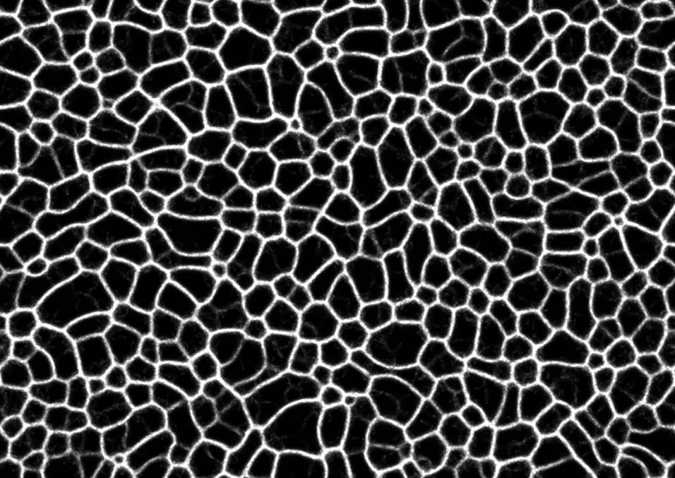
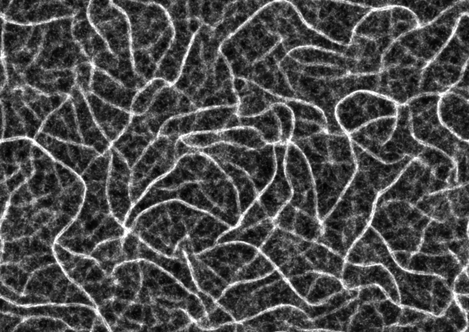
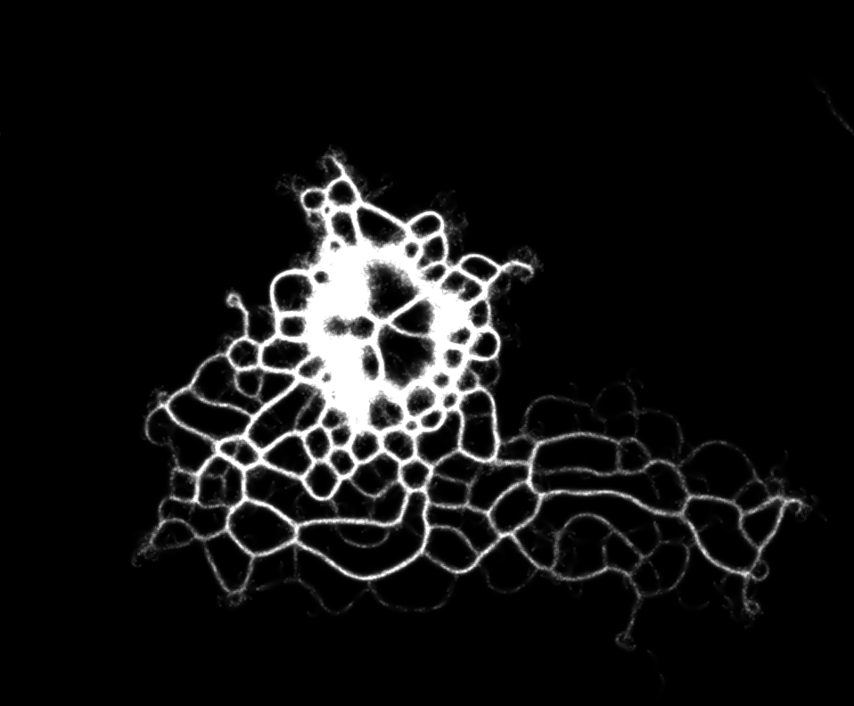
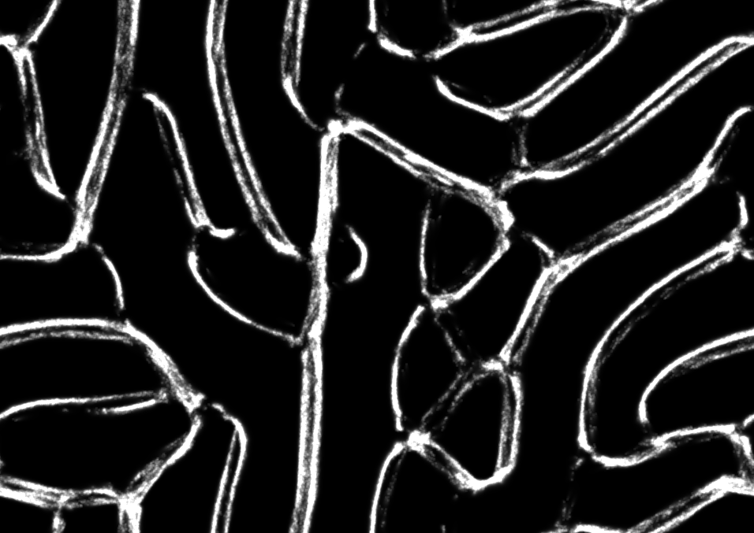
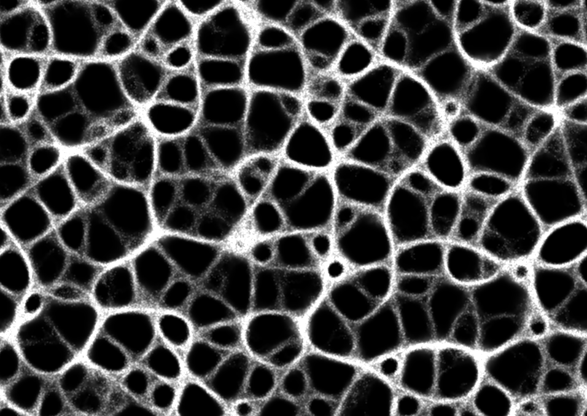

# physarum
a slime mold simulation 

inspired by this [amazing work ](https://www.sagejenson.com/physarum)

implemented from [this paper](http://eprints.uwe.ac.uk/15260/1/artl.2010.16.2.pdf)

you can try the [demo](
https://www.barradeau.com/2019/1003/)
click drag to draw, double click to create a disc with all the particles

the values:
- SA and RA control the changes in direction ( Sensor Angle and Rotation Angle)
- SO and SS are the look ahead distance and step size (speed) respectively.
- radius controls the size of the particle stream when drawing 

how to:

> `npm install`

> `npm run dev`

then build with 
> `npm run deploy`

sample images:

